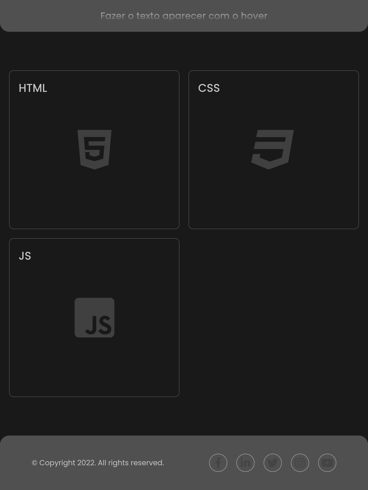
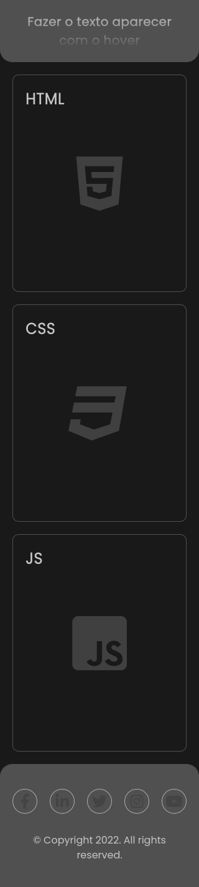
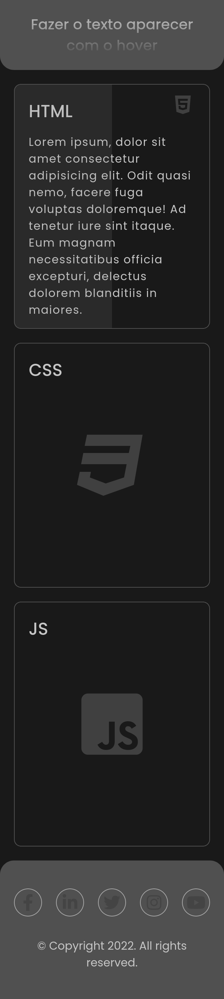

  

 

# Text Hover

Design landing page where text appears when givin focus using only HTML and CSS.

 

## Table of Contents

---

• [Prerequisites](#prerequisites) • [Technology](#technology) • [Screen Shots](#screen-shots) • [Author](#author) • [License](#license)

 

## Prerequisites

---

Before starting, you will need to have the following tolls installed on your machine:

- [Git](https://git-scm.com)
- Internet Browser:
  - [Google Chrome](https://www.google.com/chrome/)
  - [Mozilla Firefox](https://www.mozilla.org/pt-BR/firefox/new/)
  - [Microsoft Edge](https://www.microsoft.com/pt-br/edge)
- Besides, it's good to have an editor to work with the code like: [Visual Studio Code](https://code.visualstudio.com/)

 

## Technology

---

- [HTML5](https://html.com/html5/)
- [CSS3](https://www.w3schools.com/Css/)

 

## Screen Shots

---

### Laptop

 

- Text Hover

 

- Effect Hover in the Text Hover

 

### Tablet

 

- Text Hover

 

- Effect Hover in the Text Hover

 

### Mobile

 

- Text Hover

 

- Effect Hover in the Text Hover

 

## Author

---

|  |
| :-------------------------------------------------------------------------------------------------------------------------: |
|                                  [Alexandre Menezes](https://github.com/alexandresantosm)                                   |

Designed with ❤️ by Alexandre Menezes.

 

## License

---

Licensed under [MIT License](./LICENSE.md).
